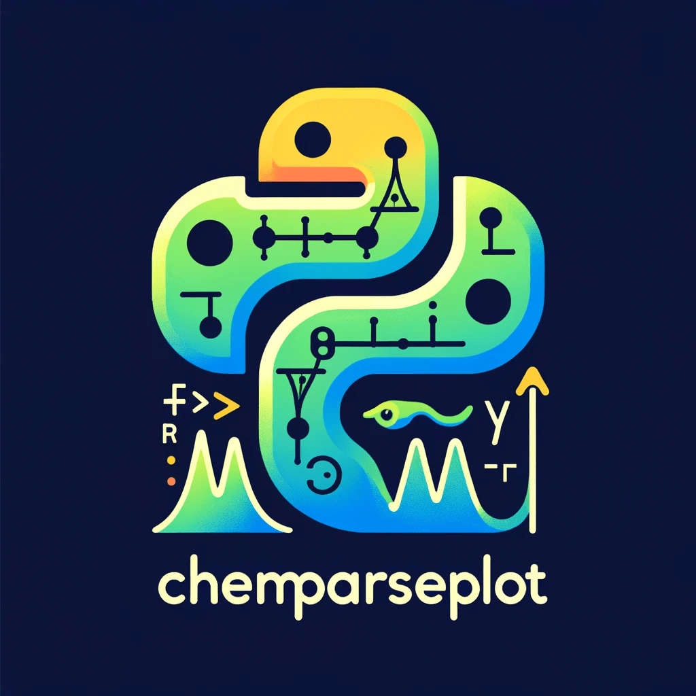

``chemparseplot``: Chemical Parsers and Plotters
================================================

About
-----

A **pure-python** [1]_  project to provide unit-aware uniform visualizations
of common computational chemistry tasks. Essentially this means we provide:

- Parsers for various computational chemistry software outputs
- Plotting scripts for specific workflows

Computational tasks (surface fitting, interpolation, structure analysis) are
delegated to ``rgpycrumbs``, which is a required dependency. ``chemparseplot``
parses output files, calls ``rgpycrumbs`` for heavy computation, and produces
publication-quality plots. For more information check the `features` page.

Documentation TOC
-----------------

.. toctree::
   :maxdepth: 2

   apidocs/index
   tutorials/index
   installation
   contributing
   features
   worklog/graphTrials

Features
~~~~~~~~

- `Scientific color maps <https://www.fabiocrameri.ch/colourmaps/>`_ for the plots
  - Camera ready
- Unit preserving
  - Via ``pint``

These are supported for:

License
-------

MIT. However, this is an academic resource, so **please cite** as much as possible
via:

- The Zenodo DOI for general use.

- The ``wailord`` paper for ORCA usage

Indices and tables
==================

* :ref:`genindex`
* :ref:`modindex`
* :ref:`search`

.. [1] To distinguish it from my other thin-python wrapper projects
