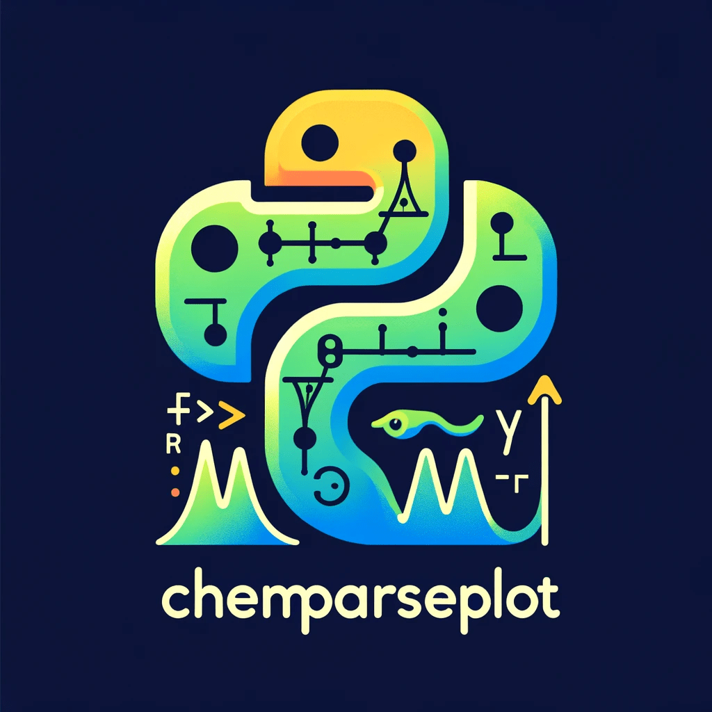

``chemparseplot``: Chemical Parsers and Plotters
================================================

.. grid:: 1 2 3 3
   :gutter: 2
   :padding: 1 1 0 0
   :class-container: sd-text-center

   .. grid-item-card:: Parse
      :link: quickstart
      :link-type: doc
      :class-card: sd-shadow-sm

      Structured extractors for ORCA, eOn, Sella, and ChemGP outputs.

   .. grid-item-card:: Project
      :link: features
      :link-type: doc
      :class-card: sd-shadow-sm

      RMSD reaction-valley coordinates and unit-aware energy scales.

   .. grid-item-card:: Plot
      :link: tutorials/index
      :link-type: doc
      :class-card: sd-shadow-sm

      Publication-ready profiles, landscapes, and structure strips.

About
-----

A **pure-python** parsing and plotting library for computational chemistry
outputs. ``chemparseplot`` extracts structured data from quantum chemistry codes
(ORCA, eOn, Sella, ChemGP) and produces publication-quality, unit-aware
visualizations with `scientific color maps
<https://www.fabiocrameri.ch/colourmaps/>`_.

Computational tasks (surface fitting, interpolation, structure analysis) are
delegated to `rgpycrumbs <https://rgpycrumbs.rgoswami.me>`_, which is a
required dependency for landscape GPs. For more information see the
:doc:`features` page.

Suite stack
-----------

How parsers, plot helpers, and the CLI suite relate:

.. mermaid::

   flowchart TB
     subgraph engines["Engines"]
       EON[eOn]
       ORCA[ORCA]
       SELLA[Sella]
     end
     subgraph cpp["chemparseplot"]
       PARSE[parse.*]
       PLOT[plot.neb / plot.optimization]
       SFC[SurfaceFitConfig]
     end
     subgraph rgp["rgpycrumbs"]
       SURF[surfaces GP]
       CLI[eon plt-neb / plt-min]
       TOML["plot.toml --config"]
     end
     engines --> PARSE
     PARSE --> PLOT
     PLOT --> SURF
     SFC --> PLOT
     TOML --> CLI
     CLI --> PLOT
     CLI --> SFC

.. tip::

   Dense landscape fits: keep ``auto_thin`` **off** by default; opt in via
   :class:`~chemparseplot.plot.neb.SurfaceFitConfig` or rgpycrumbs plot TOML
   keys ``auto_thin`` / ``max_surface_points``.

.. toctree::
   :maxdepth: 2
   :caption: Getting Started

   quickstart
   installation
   features

.. toctree::
   :maxdepth: 2
   :caption: Guides

   tutorials/index
   contributing

.. toctree::
   :maxdepth: 2
   :caption: Reference

   apidocs/index
   used_by
   worklog/graphTrials

License
-------

MIT. However, this is an academic resource, so **please cite** as much as
possible via:

- The `Zenodo DOI <https://doi.org/10.5281/zenodo.18529752>`_ for general use.
- The ``wailord`` paper for ORCA usage.

Indices and tables
==================

* :ref:`genindex`
* :ref:`modindex`
* :ref:`search`
