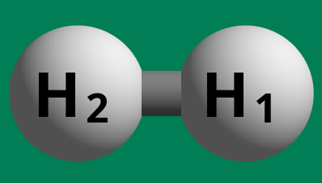

# Geometry Scan

Often it is of interest to scan for energies over a particular aspect of
molecular geometry. Here we consider the example of scanning over the bond
length of the H2 molecule.

## System construction

For simplicity, we will just use `ase` for this:

```python
from ase.build import molecule
h2 = molecule('H2')
h2.write('h2_base.xyz')
```

This can be visualized via `ase gui h2_base.xyz` to see[^1]:



### ORCA Input

To run `orca`, we can use an input file such as:

```yaml
!OPT UHF def2-SVP
%geom Scan
 # B <atmid1> <atmid2> = init, final, npoints
 # Converted from Angstrom to Bohr
 B 0 1 = 7.5589039543, 0.2116708996, 33
 end
end
*xyzfile 0 1 h2_base.xyz
```

## Execution

Following the best practices for running ORCA, we have[^2]:

```bash
export PATH=$PATH:/blah/orca_5_0_4_linux_x86-64_openmpi411/
mkdir uhf
cp orca.inp h2_base.xyz uhf
cd uhf
($(which orca) orca.inp 2>&1) | tee scan_uhf
```

# Analysis with `chemparseplot`

Now we can finally get to the good bit. Rather than painstakingly parsing "by
eye" the `scan_uhf` file, we will simply use `chemparseplot`:

```python
from pathlib import Path
from chemparseplot.parse.orca import geomscan
orcaout = Path("scan_uhf").open().read()
act_energy = geomscan.extract_energy_data(orcaout, "Actual")
print(act_energy)
(<Quantity([7.55890395 7.32930292 7.09970189 6.87010086 6.64049982 6.41089879
 6.18129776 5.95169672 5.72209569 5.49249466 5.26289362 5.03329259
 4.80369156 4.57409053 4.34448949 4.11488846 3.88528743 3.65568639
 3.42608536 3.19648433 2.9668833  2.73728226 2.50768123 2.2780802
 2.04847916 1.81887813 1.5892771  1.35967606 1.13007503 0.900474
 0.67087297 0.44127193 0.2116709 ], 'bohr')>,
 <Quantity([-7.42398620e-01 -7.43499390e-01 -7.44674460e-01 -7.45933440e-01
 -7.47288480e-01 -7.48755240e-01 -7.50354120e-01 -7.52111840e-01
 -7.54063390e-01 -7.56254250e-01 -7.58743070e-01 -7.61604610e-01
 -7.64933080e-01 -7.68845710e-01 -7.73486280e-01 -7.79028130e-01
 -7.85676030e-01 -7.93666670e-01 -8.03268580e-01 -8.14784250e-01
 -8.28557780e-01 -8.44988870e-01 -8.64547310e-01 -8.87779890e-01
 -9.15309070e-01 -9.47797640e-01 -9.85735890e-01 -1.02886903e+00
 -1.07506391e+00 -1.11633350e+00 -1.12403918e+00 -9.84131910e-01
 -7.37660000e-04], 'hartree')>)
```

Note that there are units attached, which makes subsequent analysis much easier,
since `pint` will ensure that the correct units are always used.

```python
act_energy[0].to('angstrom')
array([3.99999971, 3.87850008, 3.75700044, 3.63550081, 3.51400117,
       3.39250154, 3.27100191, 3.14950227, 3.02800264, 2.90650301,
       2.78500337, 2.66350373, 2.5420041 , 2.42050447, 2.29900483,
       2.1775052 , 2.05600557, 1.93450593, 1.8130063 , 1.69150666,
       1.57000703, 1.44850739, 1.32700776, 1.20550813, 1.08400849,
       0.96250886, 0.84100922, 0.71950959, 0.59800995, 0.47651032,
       0.35501069, 0.23351105, 0.11201142]) <Unit('angstrom')>
```


[^1]: I use [ChemCraft](https://chemcraftprog.com/) for visualization
[^2]: Discussed in more detail [here](https://rgoswami.me/posts/intro-highthrough-calc/#chemical)
