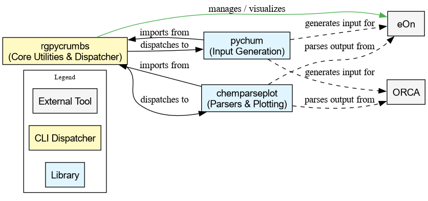

# Table of Contents

-   [About](#orgbe0e2c1)
    -   [Ecosystem Overview](#orgb769d99)
    -   [Features](#org4d684a5)
        -   [Supported Engines [WIP]](#orgdb5b5aa)
    -   [Rationale](#orgc25c267)
-   [License](#orgbf4b3dd)

# About

A **pure-python**<a id="fnr.1" class="footref" href="#fn.1" role="doc-backlink">1</a> project to provide unit-aware uniform visualizations
of common computational chemistry tasks. Essentially this means we provide:

-   Parsers for various computational chemistry software outputs
-   Plotting scripts for specific workflows

Computational tasks (surface fitting, structure analysis, interpolation) are
handled by [`rgpycrumbs`](https://github.com/HaoZeke/rgpycrumbs), which is a required dependency. `chemparseplot` parses
output files, delegates heavy computation to `rgpycrumbs`, and produces
publication-quality plots.

This is a spin-off from `wailord` ([here](https://wailord.xyz)) which is meant to handle aggregated
runs in a specific workflow, while here the goal is to do no input handling and
very pragmatic output parsing, with the goal of generating uniform plots.

## Ecosystem Overview

`chemparseplot` is part of the `rgpycrumbs` suite of interlinked libraries.

## Features

-   [Scientific color maps](https://www.fabiocrameri.ch/colourmaps/) for the plots
    -   Camera ready
-   Unit preserving
    -   Via `pint`

### Supported Engines [WIP]

-   ORCA (**5.x**)
    -   Scanning energies over a degree of freedom (`OPT` scans)
    -   Nudged elastic band (`NEB`) visualizations (over the "linearized" reaction
        coordinate)

## Rationale

`wailord` is for production runs, however often there is a need to collect
"spot" calculation visualizations, which should nevertheless be uniform, i.e.
either Bohr/Hartree or Angstron/eV or whatever.

Also I couldn't find (m)any scripts using the scientific colorschemes.

# License

MIT. However, this is an academic resource, so **please cite** as much as possible
via:

-   The [Zenodo DOI](https://doi.org/10.5281/zenodo.18529752) for general use.
-   The `wailord` paper for ORCA usage

# Footnotes

<a id="fn.1" href="#fnr.1">1</a> To distinguish it from my other thin-python wrapper projects
