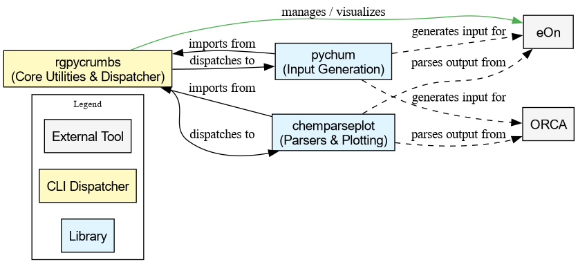

# Table of Contents

-   [About](#org93e01ab)
    -   [Installation](#org7e47c5a)
    -   [Ecosystem Overview](#org7a9b870)
    -   [Features](#org99179ae)
        -   [Supported Engines](#orgccbddba)
    -   [Documentation](#org2c21118)
    -   [Contributing](#org45b74e8)
    -   [Release Process](#orgca887b7)
-   [License](#orga641ab6)
-   [Acknowledgments](#org1ce8063)

> Canonical source note: this Org file is authoritative for contributor-facing
> documentation. Rendered Markdown files are derived artifacts and should not be
> edited separately.

# About

A **pure-python**<a id="fnr.1" class="footref" href="#fn.1" role="doc-backlink">1</a> parsing and plotting library for computational
chemistry outputs. `chemparseplot` extracts structured data from quantum
chemistry codes (ORCA, eOn, Sella, ChemGP) and produces publication-quality,
unit-aware visualizations with [scientific color maps](https://www.fabiocrameri.ch/colourmaps/).

Computational tasks (surface fitting, structure analysis, interpolation) are
handled by [`rgpycrumbs`](https://github.com/HaoZeke/rgpycrumbs), which is a required dependency. `chemparseplot` parses
output files, delegates heavy computation to `rgpycrumbs`, and produces
publication-quality plots.

## Installation

    pip install chemparseplot
    # With plotting support
    pip install "chemparseplot[plot]"
    # Everything
    pip install "chemparseplot[all]"

For development:

    git clone https://github.com/HaoZeke/chemparseplot
    cd chemparseplot
    uv sync --all-extras

See the [installation guide](https://chemparseplot.rgoswami.me/installation.html) and [quickstart](https://chemparseplot.rgoswami.me/quickstart.html) for details.

## Ecosystem Overview

`chemparseplot` is part of the `rgpycrumbs` suite of interlinked libraries.

## Features

-   **Parsing** computational chemistry output files into structured data
-   **Plotting** with [scientific color maps](https://www.fabiocrameri.ch/colourmaps/) (camera-ready)
-   **Unit preserving** throughout via `pint`
-   **Computation** delegated to [`rgpycrumbs`](https://github.com/HaoZeke/rgpycrumbs) for surface fitting, interpolation,
    and structure analysis

### Supported Engines

-   ORCA (**5.x**)
    -   Geometry scan (`OPT`) energy profiles
    -   Nudged elastic band (`NEB`) path visualization
-   eOn
    -   Saddle search parsing (Dimer, GPRD, LBFGS methods)
    -   NEB path energy profiles with landscape projections
-   Sella
    -   Saddle point optimization result parsing
-   Trajectory formats
    -   HDF5 trajectories (ChemGP output with pre-computed forces)
    -   Generic ASE-readable formats (extxyz, .traj) for NEB analysis
-   Multi-segment NEB stitching (`stitch_neb_segments`) for continuous bands
    across chained minimizations (v1.8+)
-   Metadata-native eOn CON frames (prefer JSON metadata energies over `.dat`
    tables) with typed parser results shared by NEB and single-ended tools
-   Unit-aware NEB/optimization plot helpers (`convert_neb_values`, centralized
    strip rendering) consumed by `rgpycrumbs` CLIs

## Documentation

Full documentation is at <https://chemparseplot.rgoswami.me>. This includes:

-   A [quickstart guide](https://chemparseplot.rgoswami.me/quickstart.html)
-   [Tutorials](https://chemparseplot.rgoswami.me/tutorials/index.html) for common workflows
-   [API reference](https://chemparseplot.rgoswami.me/apidocs/index.html)

## Contributing

Contributions are welcome. See [CONTRIBUTING.md](https://github.com/HaoZeke/chemparseplot/blob/main/CONTRIBUTING.md) for development setup and
guidelines, and our [Code of Conduct](https://github.com/HaoZeke/chemparseplot/blob/main/CODE_OF_CONDUCT.md).

For bug reports or questions, open an issue on [GitHub](https://github.com/HaoZeke/chemparseplot/issues).

## Release Process

Versions are derived automatically from Git tags via `hatch-vcs`. We keep
`towncrier` for release-note aggregation and use `cocogitto` (`cog`) for the
semantic version/tag step. The actual publish step is already handled by the
tag-triggered `.github/workflows/release.yml` workflow.

    # 1. Run the same checks the tag workflow expects
    uv sync --extra test --extra plot --extra release
    uv run pytest --cov=chemparseplot tests
    uv run ruff check .
    uv run ruff format --check .
    uv run sphinx-build doc/source/ doc/build
    
    # 2. Preview the next semantic version from Conventional Commits
    cog bump --dry-run --auto
    
    # 3. Aggregate towncrier fragments into the changelog
    #    towncrier headings use X.Y.Z, while the git tag stays vX.Y.Z
    uvx towncrier build --version "1.7.1"
    
    # 4. Commit the release notes (historically: release: vX.Y.Z)
    git add CHANGELOG.md doc/release/upcoming_changes
    git commit -m "release: v1.7.1"
    
    # 5. Apply the release tag (hatch-vcs reads the version from tags)
    cog bump --auto
    
    # 6. Push main and tags; CI publishes from the tag
    git push origin main --tags

# License

MIT. However, this is an academic resource, so **please cite** as much as possible
via:

-   The [Zenodo DOI](https://doi.org/10.5281/zenodo.18529752) for general use.
-   The `wailord` paper for ORCA usage

# Acknowledgments

This project builds on work supported by the University of Iceland and the
Icelandic Research Fund. `chemparseplot` relies on [`rgpycrumbs`](https://github.com/HaoZeke/rgpycrumbs) for computational
modules.

# Footnotes

<a id="fn.1" href="#fnr.1">1</a> To distinguish it from my other thin-python wrapper projects
