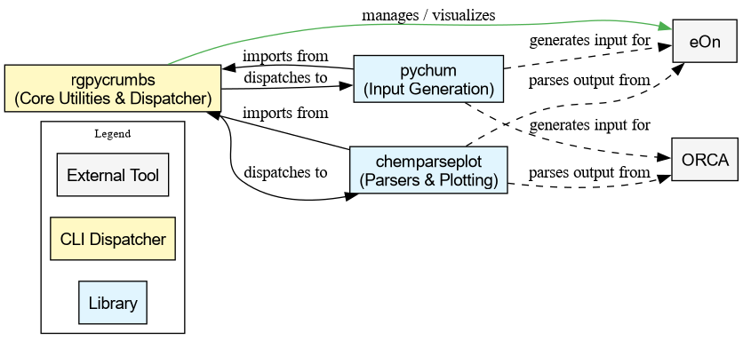

#+OPTIONS: num:nil

#+begin_quote
Canonical source note: this Org file is authoritative for contributor-facing
documentation. Rendered Markdown files are derived artifacts and should not be
edited separately.
#+end_quote

* About
file:branding/logo/chemparseplot_logo.png
#+begin_export markdown

#+end_export
A *pure-python*[fn:butwhy] parsing and plotting library for computational
chemistry outputs. ~chemparseplot~ extracts structured data from quantum
chemistry codes (ORCA, eOn, Sella, ChemGP) and produces publication-quality,
unit-aware visualizations with [[https://www.fabiocrameri.ch/colourmaps/][scientific color maps]].

Computational tasks (surface fitting, structure analysis, interpolation) are
handled by [[https://github.com/HaoZeke/rgpycrumbs][~rgpycrumbs~]], which is a required dependency. ~chemparseplot~ parses
output files, delegates heavy computation to ~rgpycrumbs~, and produces
publication-quality plots.

** Installation

#+begin_src bash
pip install chemparseplot
# With plotting support
pip install "chemparseplot[plot]"
# Everything
pip install "chemparseplot[all]"
#+end_src

For development:

#+begin_src bash
git clone https://github.com/HaoZeke/chemparseplot
cd chemparseplot
uv sync --all-extras
#+end_src

See the [[https://chemparseplot.rgoswami.me/installation.html][installation guide]] and [[https://chemparseplot.rgoswami.me/quickstart.html][quickstart]] for details.

** Ecosystem Overview
   ~chemparseplot~ is part of the ~rgpycrumbs~ suite of interlinked libraries.

** Features
- *Parsing* computational chemistry output files into structured data
- *Plotting* with [[https://www.fabiocrameri.ch/colourmaps/][scientific color maps]] (camera-ready)
- *Unit preserving* throughout via ~pint~
- *Computation* delegated to [[https://github.com/HaoZeke/rgpycrumbs][~rgpycrumbs~]] for surface fitting, interpolation,
  and structure analysis

*** Supported Engines
- ORCA (*5.x*)
  + Geometry scan (~OPT~) energy profiles
  + Nudged elastic band (~NEB~) path visualization
- eOn
  + Saddle search parsing (Dimer, GPRD, LBFGS methods)
  + NEB path energy profiles with landscape projections
- Sella
  + Saddle point optimization result parsing
- Trajectory formats
  + HDF5 trajectories (ChemGP output with pre-computed forces)
  + Generic ASE-readable formats (extxyz, .traj) for NEB analysis

** Documentation

Full documentation is at [[https://chemparseplot.rgoswami.me]]. This includes:
- A [[https://chemparseplot.rgoswami.me/quickstart.html][quickstart guide]]
- [[https://chemparseplot.rgoswami.me/tutorials/index.html][Tutorials]] for common workflows
- [[https://chemparseplot.rgoswami.me/apidocs/index.html][API reference]]

** Contributing

Contributions are welcome. See [[https://github.com/HaoZeke/chemparseplot/blob/main/CONTRIBUTING.md][CONTRIBUTING.md]] for development setup and
guidelines, and our [[https://github.com/HaoZeke/chemparseplot/blob/main/CODE_OF_CONDUCT.md][Code of Conduct]].

For bug reports or questions, open an issue on [[https://github.com/HaoZeke/chemparseplot/issues][GitHub]].

** Release Process

Versions are derived automatically from Git tags via ~hatch-vcs~. We keep
~towncrier~ for release-note aggregation and use ~cocogitto~ (~cog~) for the
semantic version/tag step. The actual publish step is already handled by the
tag-triggered ~.github/workflows/release.yml~ workflow.

#+begin_src bash
# 1. Run the same checks the tag workflow expects
uv sync --extra test --extra plot --extra release
uv run pytest --cov=chemparseplot tests
uv run ruff check .
uv run ruff format --check .
uv run sphinx-build doc/source/ doc/build

# 2. Preview the next semantic version from Conventional Commits
uvx cocogitto cog bump --dry-run --auto

# 3. Aggregate towncrier fragments into the changelog
#    towncrier headings use X.Y.Z, while the git tag stays vX.Y.Z
uvx towncrier build --version "1.7.1"

# 4. Commit the release notes (historically: release: vX.Y.Z)
git add CHANGELOG.md doc/release/upcoming_changes
git commit -m "release: v1.7.1"

# 5. Apply the release tag (hatch-vcs reads the version from tags)
uvx cocogitto cog bump --auto

# 6. Push main and tags; CI publishes from the tag
git push origin main --tags
#+end_src

* License
MIT. However, this is an academic resource, so *please cite* as much as possible
via:
- The [[https://doi.org/10.5281/zenodo.18529752][Zenodo DOI]] for general use.
- The ~wailord~ paper for ORCA usage

* Acknowledgments
This project builds on work supported by the University of Iceland and the
Icelandic Research Fund. ~chemparseplot~ relies on [[https://github.com/HaoZeke/rgpycrumbs][~rgpycrumbs~]] for computational
modules.

[fn:butwhy] To distinguish it from my other thin-python wrapper projects
